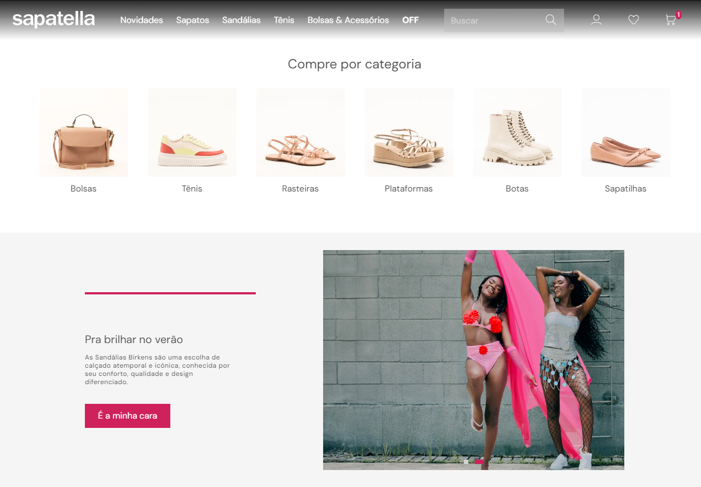
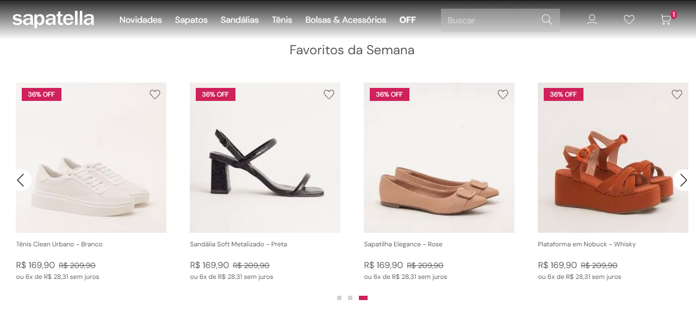
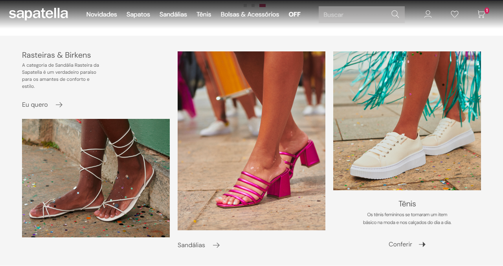
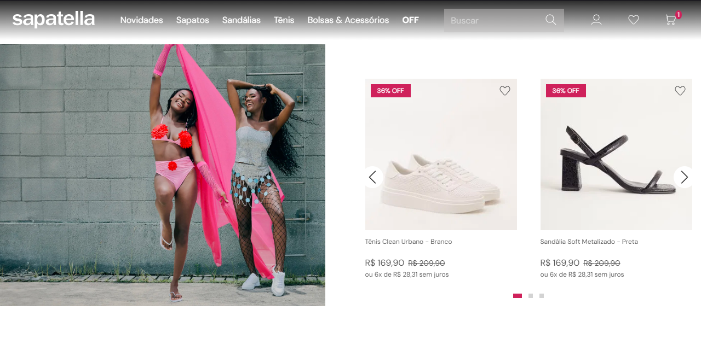
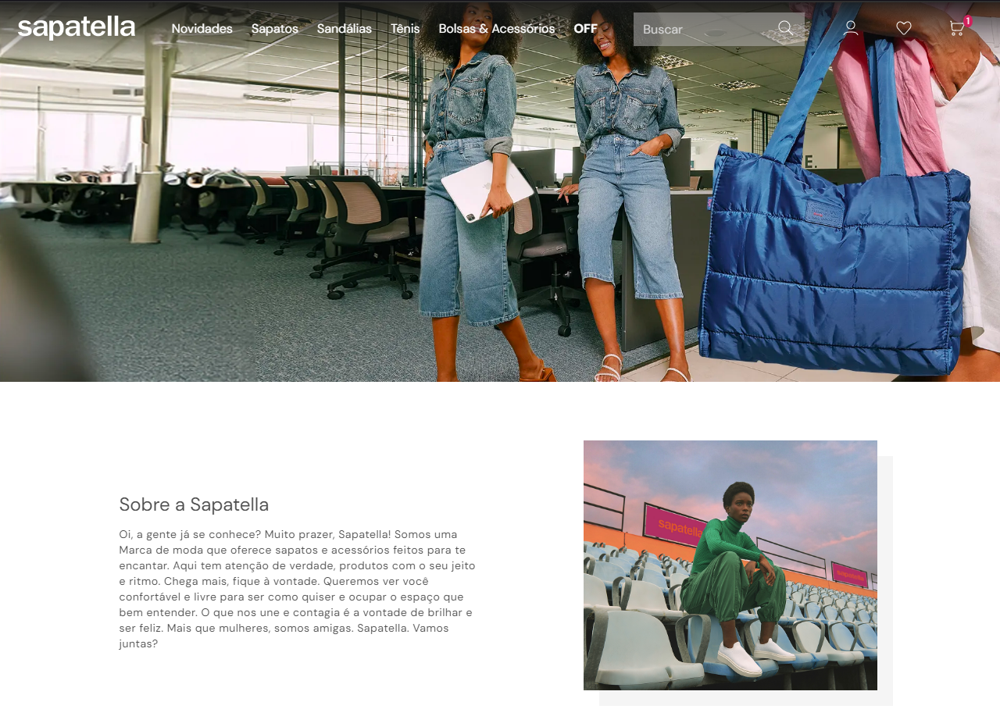

## Sapatella / isgabriel

A Sapatella é uma loja online especializada em calçados femininos exclusivos. Encontre o par perfeito para cada ocasião!

## Tecnologias

Aqui estão as tecnologias usadas nesse projeto:

-   React
-   Typescript
-   Sass
-   Swiper (Carrossel)

## Serviço usado

-   Github
-   Git Flow
-   Vercel
-   Figma
-   VS Code

## Como usar

 <h3>1 - Ao acessar a página, você verá o bannerl</h3>
 

 <h3>2 - Seção categorias</h3>
 

 <h3>3 - Seção favoritos da semana</h3>
 

 <h3>4 - Seção highlight de produtos</h3>
 

 <h3>5 - Seção com mais produtos</h3>
 

 <h3>6 - Seção sobre a Sapatella</h3>
 

 <h3>7 - Seção Footer</h3>
 

## Funcionalidades

As principais funcionalidades da aplicação são:

-   Visualizar produtos em carrossel;
-   Selecionar tamanho do produto;
-   Adicionar/remover itens ao carrinho;
-   Adicionar/remover itens aos favoritos.

## Links

-   Deploy: https://teste-wicomm-sapatella-frontend.vercel.app/
-   Repository: https://github.com/isgabriel/teste-wicomm-sapatella_frontend

## Autores

-   <strong>Gabriel Fragoso Montenegro</strong>

    Por favor, siga o github e junte-se a mim! Obrigado pela visita! <3
